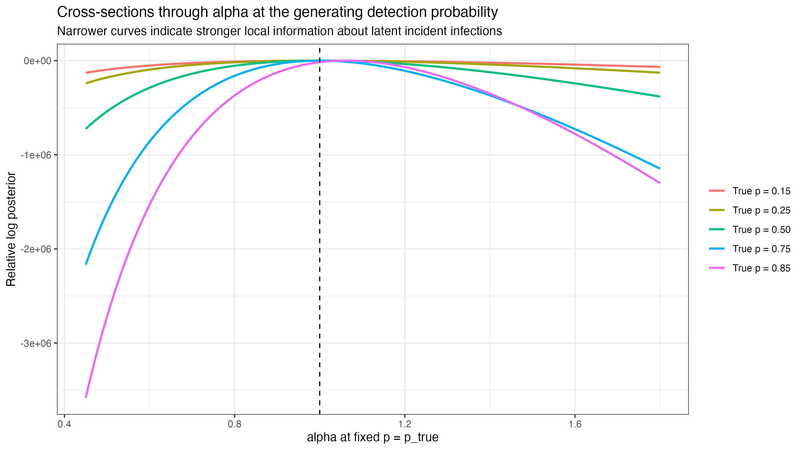
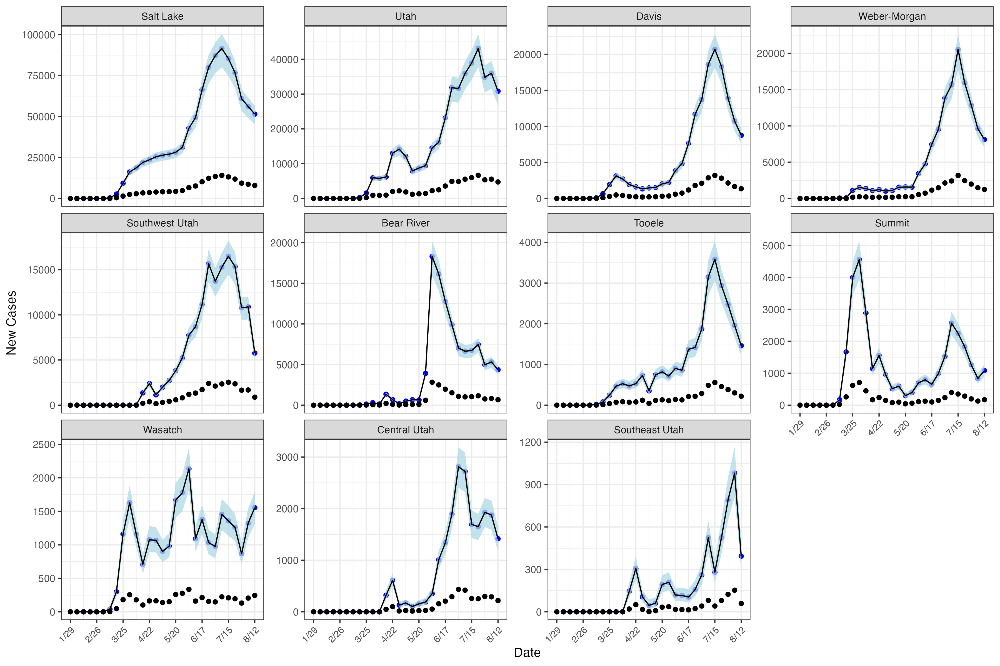
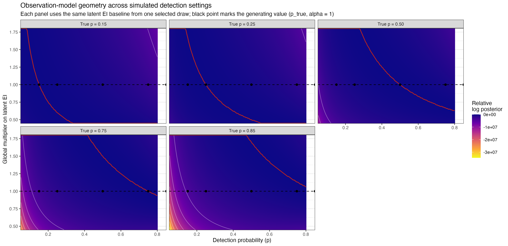

```{r, include=FALSE,echo=F}
library(tidyverse) 
library(cmdstanr)
library(flextable)
library(knitr)
library(kableExtra)
### Primary results
new_csv=unlist(1:4 %>% purrr::map(~paste0("./tst_folder_sig/SEIR_betabin_on_hier_ar1_beta_pbeta_zeros_v10-202511131059-",.,"-3f135e.csv")))
fit=as_cmdstan_fit(new_csv)

mu_log_beta = fit$summary("mu_log_beta") %>% as_tibble %>% mutate_at(vars(c("mean","q5","q95")), ~round(.,2))
sigma= fit$summary("sigma") %>% as_tibble %>% mutate_at(vars(c("mean","q5","q95")), ~round(.,2))
eta = fit$summary("eta") %>% as_tibble %>% mutate_at(vars(c("mean","q5","q95")), ~round(.,2))
gamma = fit$summary("gamma") %>% as_tibble %>% mutate_at(vars(c("mean","q5","q95")), ~round(.,2))
phi = fit$summary("phi") %>% as_tibble %>% mutate_at(vars(c("mean","q5","q95")), ~round(.,2))
rho_ei = fit$summary("rho_ei") %>% as_tibble %>% mutate_at(vars(c("mean","q5","q95")), ~round(.,2))
rho_ir = fit$summary("rho_ir") %>% as_tibble %>% mutate_at(vars(c("mean","q5","q95")), ~round(.,2))

### Simulation
p_est=readRDS("p_estimates_v2.rds")
rate_div=readRDS("rate_div_v2.rds")
```


# Introduction

Unobservable individual-level heterogeneity in contact patterns, susceptibility and propensity to get tested are hallmark characteristics of infectious disease transmission and case reporting [@lloydsmith] (need more here about heterogeneity in susceptiblity and reporting).
Such unobservable heterogeneity suggests that models of infectious disease transmission should incorporate stochastic elements in both the state and observation processes (maybe cite a paper about POMP here).
At the same time, public health authorities recorded finely-stratified COVID-19 disease surveillance data, which allowed for models to incorporate shared spatio-temporal and demographic heterogeneity in order to characterize the nuances of local transmission.
Unfortunately, building such stochastic structure into discrete-time transmission modeling frameworks like endemic-epidemic (EE) models or time-series-susceptible-infected-removed (TSIR) models is challenging due to the computational burden of integrating over latent discrete state spaces [@2005-Held-Surveillance-Counts;@2019-Wakefield-Book-Surveillance-Data;@hoDirectLikelihoodbasedInference2018].

Recent innovations in addressing the computational burden of fitting complex stochastic transmission models include linear noise approximations or LNA [@fintziLinearNoiseApproximation2022], particle filtering and iterated filtering [@liInferenceSpatiotemporalDynamics2024], Dirichlet distributed compartment models [@zhouSpatiotemporalEpidemiologicalPrediction2020;@tang2020], and exact marginalization using Laplace Transformations [@hoDirectLikelihoodbasedInference2018]. 
While these approaches have merits, as model complexity grows the computational burden associated with each increases substantially.

Under-ascertainment of disease cases in surveillance data further exacerbates these challenge as models must also contend with the complication of biased measurement error. 
Each so-called line-listing reported by a state health agency typically represents a symptomatic case of the disease of interest or an asymptomatic case that was identified in subsequent contact tracing.
Under-counting may result from asymptomatic cases that go undetected or from lack of access to testing, both of which led to deflated case counts during the COVID-19 pandemic.
Thus, effective models for transmission dynamics must incorporate a factor to account for under-counting.

Various approaches have been developed in order to estimate disease ascertainment rates in infectious disease data including seroprevalence studies [@taylor2023seroprevalence; @samore2021probability], multiplier models [@reese2021estimated], back-calculation from deaths or hospitalizations, and most commonly, dynamic transmission models or compartment models which jointly estimate disease dynamics and disease ascertainment rate [@deo2021new; @chitwood2022reconstructing]. 
These dynamic transmission models are typically ODE-based models, which correspond to large-population limits of more realistic stochastic transmission models with discrete state spaces [@keeling2008modeling].
When continuous time stochastic transmission models are employed, considerable 

We address both of these problems by developing a novel continuous stochastic approximation to a discrete-time discrete-state-space stochastic compartment model. 
Our contribution is three-fold:

1. We allow for over-dispersed state transitions via beta-binomial random variables, while learning the extent of the over-dispersion.

2. The model handles the complexity of recent surveillance data via geography-specific and time-varying transmission rate using a hierarchical AR(1) process, again with unknown hyperparameters.

3. In order to make fitting these models feasible, we do Bayesian inference in order to take advantage of strong prior information on epidemiological parameters in the context of COVID-19.

The continuous approximation allows tractable computation through the use of  of modern Markov Chain Monte Carlo approaches like the adaptive Hamiltonian Monte Carlo algorithm implemented in `Stan`.

In Section 2 we introduce our model and the continuous approximation of the discrete time stochastic process, while in Section 3 we investigate the finite sample operating characteristics via a simulation study under varying degrees of underreporting.
Section 4 applies our model to COVID-19 data from the first year of the COVID-19 pandemic in Utah, and in Section 5 we discuss our contribution. 

# Model for disease surveillance data

## Discrete-time discete state space transmission model

Let $y_{g,t}$ be the number of cases of a specific infectious disease recorded by a public health agency associated with a geography $g$ at time step $t$.
We assume these realized cases represent a fraction of total incident cases, which are generated as increments in the underlying discrete-time stochastic compartment model.
This transmission process follows a stochastic susceptible-exposed-infected-removed (SEIR) model; we adapt notation developed in @fintziLinearNoiseApproximation2022 to discrete time. 
The SEIR model is characterized as a discrete state Markov chain with state $\mathbf{X}_{g,t} = (S_{g,t}, E_{g,t}, I_{g,t}, R_{g,t})$, representing the number of individuals in the states susceptible (S), exposed (E), infected (I), and removed (R) in a population of size ${S}_{g,0}$.

Movements between these states are tracked via a multivariate counting process for each geography and time step, $\mathbf{N}_{g,t}$, comprising cumulative counts from time $0$ through time step $t$ of movements of individuals between compartments:
$$
\mathbf{N}_{g,t} = \left(N^{SE}_{g,t}, N^{EI}_{g,t}, N^{IR}_{g,t} \right)
$$
The movements between time step $t-1$ to $t$ are collected in a vector $\Delta \mathbf{N}_{g,t}$, which collects the transitions susceptible-to-exposed (SE), exposed-to-infected (EI), and exposed-to-removed (IR):
$$
\Delta\mathbf{N}_{g,t} = \left(\Delta N^{SE}_{g,t}, \Delta N^{EI}_{g,t},\Delta N^{IR}_{g,t} \right)
$$
These increments are necessarily non-negative integers, though in contrast to a continuous time model these increments may be larger than $1$.  
Then we can write, $\mathbf{N}_{g,t}$ as an initial state $\mathbf{N}_{g,0}$ and sums of increments $\Delta \mathbf{N}_{g,t}$:
$$
\begin{aligned}
\mathbf{N}_{g,t} & = \mathbf{N}_{g,0} + \sum_{j=1}^t \Delta \mathbf{N}_{g,t}
\end{aligned}
$$

In order to complete our model specification, we need to determine distributions for each transition. 
Following the convention from endemic/epidemic models, introduced in @2005-Held-Surveillance-Counts, we assume there are $S_{g,t-1}$ susceptible individuals that are subjected to a force of infection $\beta_{g,t} I_{g,t - 1} / S_{g,0}$, such that the number of incident cases conditional on $S_{g,t-1}, I_{g,t-1}$ and $\beta_{g,t}$, are binomial random variables:
$$
\Delta N^{SE}_{g,t} \sim \text{Binomial}\!\Bigl(S_{g,t-1},\,1 - \exp\!\bigl(-\tfrac{\beta_{g,t}I_{g,t-1}}{S_{g,0}}\bigr)\Bigr)
$$
Contact rate and susceptibility may be local to time and geography, and thus we allow these to change by geography and time in order to capture systematic variation.

In order to account for unobservable individual heterogeneity, we assume that $\Delta N^{EI}_{g,t}$ and $\Delta N^{IR}_{g,t}$ are distributed as beta-binomial random variables: 
$$
\begin{aligned}
\Delta N^{EI}_{g,t} &\sim \text{BetaBinomial}\!\left(E_{g,t-1},\,1 - \exp(-\eta_g),\rho_{EI}\right),\\
\Delta N^{IR}_{g,t} &\sim \text{BetaBinomial}\!\left(I_{g,t-1},\,1 - \exp(-\gamma_g),\rho_{IR}\right),\\
\end{aligned}
$$
In the definitions above, we use the parameterization $Z \sim \text{BetaBinomial}(\mu, \rho)$, where $\mathbb{E}[Z] = \mu$ and $\text{Var}(Z) = \mu (1 - \mu) / (\rho + 1)$. 

Finally, incident cases are $y_{g,t}$ are assumed to be binomial conditional on $\Delta N^{EI}_{g,t}$ and an unknown reporting probability:  $y_{g,t} \sim \text{Binomial}(\Delta N^{EI}_{g,t}, p)$.

While this model represents a plausible model for infectious disease transmission, integrating over the large unobservable state space of $\Delta \mathbf{N}_{g,t}$ would result in a combinatorial explosion. 
In the next section, we present a tractable continuous approximation to this process.

<!-- We fit a stochastic model on weekly new case counts across 11 health districts in Utah based on the SEIR (Susceptible–Exposed–Infected–Removed) compartmental model used to simulate Covid-19 infections. Given the complexity of Covid-19 case report data due to shifting policy and safety precautions, our approach required flexibility in the dynamics between compartments over time and in space. Specifically, we fit a model which allowed the force of infection to change over time and for it and the rate of movement between E and I compartments and I and R compartments to differ between districts. Finally, our model does not assume that the dynamics in the SEIR compartmental model start at the same time as cases reported in Utah at the district level do not start in the same week. -->

## Continuous approximation to discrete state space

The key challenge in approximating the above process is that we must contend with bounds on all increments in order to preserve the mass action that is the raison d'&#234;tre of compartment modeling.
First, we move to proportions instead of counts, which is similar in spirit to the approach taken in @zhouSpatiotemporalEpidemiologicalPrediction2020. 
Let $\mathbf{x}_{g,t} = (s_{g,t}, e_{g,t}, i_{g,t}, r_{g,t})$ represent the proportions of the population that fall into each compartment.
Further, let $\boldsymbol{\pi}_{g,t}$, with elements $(\pi^{SE}_{g,t},\pi^{EI}_{g,t},\pi^{IR}_{g,t})$ represent the proportions of the population represented by the increment $\Delta \mathbf{N}_{g,t}$, or $\boldsymbol{\pi}_{g,t} = \Delta \mathbf{N}_{g,t} / S_{g,0}$.

We approximate the distribution of each element 

$$
\begin{aligned}
    \mathbb{E}\left[\frac{SE_t}{N}\right] &= s_{t-1} (1 - \exp(-\beta i_{t-1})), & \quad \text{Var}\left(\frac{SE_t}{N}\right) &= \frac{s_{t-1}}{N} \exp(-\beta i_{t-1})(1 - \exp(-\beta i_{t-1})) \\
    \mathbb{E}\left[\frac{EI_t}{N}\right] &= e_{t-1} (1 - \exp(-\eta)), & \quad \text{Var}\left(\frac{EI_t}{N}\right) &= \frac{e_{t-1}}{N} \exp(-\eta)(1 - \exp(-\eta)) \\
    \mathbb{E}\left[\frac{IR_t}{N}\right] &= i_{t-1} (1 - e^{-\gamma}), & \quad \text{Var}\left(\frac{IR_t}{N}\right) &= \frac{i_{t-1}}{N} e^{-\gamma}(1 - e^{-\gamma})
\end{aligned}
$$

Let $se_t$, $ei_t$, and $ir_t$ be random variables with bounds $[0, s_{t-1}]$, $[0, e_{t-1}]$, and $[0, i_{t-1}]$, respectively.
We need to find $u_t$, $v_t$, and $w_t$ distributed on $[0, 1]$ such that $se_t = u_t s_{t-1}$, $ei_t = v_t e_{t-1}$, and $ir_t = i_{t-1} w_t$ with the same mean and variance.

$$
\begin{aligned}
    \mathbb{E}[s_{t-1} u_t] &= s_{t-1} \mathbb{E}[u_t] = s_{t-1}(1 - \exp(-\beta i_{t-1})) \\
    \text{Var}(s_{t-1} u_t) &= s_{t-1}^2 \text{Var}(u_t) = \frac{s_{t-1}}{N} \exp(-\beta i_{t-1})(1 - \exp(-\beta i_{t-1})) \\
    \mathbb{E}[e_{t-1} v_t] &= e_{t-1} \mathbb{E}[v_t] = e_{t-1}(1 - \exp(-\eta)) \\
    \text{Var}(e_{t-1} v_t) &= e_{t-1}^2 \text{Var}(v_t) = \frac{e_{t-1}}{N} \exp(-\eta)(1 - \exp(-\eta)) \\
    \mathbb{E}[i_{t-1} w_t] &= i_{t-1} \mathbb{E}[w_t] = i_{t-1}(1 - e^{-\gamma}) \\
    \text{Var}(i_{t-1} w_t) &= i_{t-1}^2 \text{Var}(w_t) = \frac{i_{t-1}}{N} e^{-\gamma}(1 - e^{-\gamma})
\end{aligned}
$$

Solving for $\mathbb{E}[u_t]$, $\text{Var}(u_t)$, $\mathbb{E}[v_t]$, $\text{Var}(v_t)$, $\mathbb{E}[w_t]$, and $\text{Var}(w_t)$ implies

$$
\begin{aligned}
    \mathbb{E}[u_t] &= (1 - \exp(-\beta i_{t-1})) \\
    \text{Var}(u_t) &= \frac{1}{s_{t-1} N} \exp(-\beta i_{t-1})(1 - \exp(-\beta i_{t-1})) \\
    \mathbb{E}[v_t] &= (1 - \exp(-\eta)) \\
    \text{Var}(v_t) &= \frac{1}{e_{t-1} N} \exp(-\eta)(1 - \exp(-\eta)) \\
    \mathbb{E}[w_t] &= (1 - e^{-\gamma}) \\
    \text{Var}(w_t) &= \frac{1}{i_{t-1} N} e^{-\gamma}(1 - e^{-\gamma})
\end{aligned}
$$

What we could do is to take $\tilde{u}_t$, $\tilde{v}_t$, $\tilde{w}_t \sim \text{Normal}$ and let $u_t = \text{inv\_logit}(\tilde{u}_t)$, $v_t = \text{inv\_logit}(\tilde{v}_t)$, and $w_t = \text{inv\_logit}(\tilde{w}_t)$.

The downside of this approach is that the expectation of the inverse logit of a normal does not have an analytic form, but we could approximate with the Delta method.
Let 

$$
\tilde{u}_t \sim \text{Normal}(\mu_u, \sigma^2_u), \tilde{v}_t \sim \text{Normal}(\mu_v, \sigma^2_v), \tilde{w}_t \sim \text{Normal}(\mu_w, \sigma^2_w).
$$

We need to find $\mu_u$, $\sigma^2_u$, $\mu_v$, $\sigma^2_v$, $\mu_w$, $\sigma^2_w$ such that 

$$
\begin{aligned}
\mathbb{E}[\text{expit}(\tilde{u}_t)] \approx (1 - \exp(-\beta i_{t-1})), &\quad \text{Var}(\text{expit}(\tilde{u}_t)) \approx \frac{1}{s_{t-1} N} \exp(-\beta i_{t-1})(1 - \exp(-\beta i_{t-1})) \\
\mathbb{E}[\text{expit}(\tilde{v}_t)] \approx (1 - \exp(-\eta)), \quad & \text{Var}(\text{expit}(\tilde{v}_t)) \approx \frac{1}{e_{t-1} N} \exp(-\eta)(1 - \exp(-\eta)) \\
\mathbb{E}[\text{expit}(\tilde{w}_t)] \approx (1 - e^{-\gamma}), \quad & \text{Var}(\text{expit}(\tilde{w}_t)) \approx \frac{1}{i_{t-1} N} e^{-\gamma}(1 - e^{-\gamma})
\end{aligned}
$$

Using the delta method gives that 

$$
\begin{aligned}
\mathbb{E}[\text{expit}(\tilde{u}_t)] \approx \text{expit}(\mu_u), & \quad \text{Var}(\text{expit}(\tilde{u}_t)) \approx \sigma_u^2 (\text{expit}(\mu_u)^\prime)^2 \\
\mathbb{E}[\text{expit}(\tilde{v}_t)] \approx \text{expit}(\mu_v), & \quad \text{Var}(\text{expit}(\tilde{v}_t)) \approx \sigma_v^2 (\text{expit}(\mu_v)^\prime)^2 \\
\mathbb{E}[\text{expit}(\tilde{w}_t)] \approx \text{expit}(\mu_w), &\quad \text{Var}(\text{expit}(\tilde{w}_t)) \approx \sigma_w^2 (\text{expit}(\mu_w)^\prime)^2
\end{aligned}
$$

This leads to the following parameters:

$$
\begin{aligned}
    \mu_u &= \text{logit}(1 - \exp(-\beta i_{t-1}))  \\
    \sigma_u^2 &= \frac{1}{s_{t-1} N} \frac{\exp(-\beta i_{t-1})(1 - \exp(-\beta i_{t-1}))}{((1 - \text{expit}(\mu_u))\text{expit}(\mu_u))^2} \\
    &= \frac{1}{\exp(-\beta i_{t-1})(1 - \exp(-\beta i_{t-1})) s_{t-1} N} \\
    \mu_v &= \text{logit}(1 - \exp(-\eta))  \\
    \sigma_v^2 &= \frac{1}{e_{t-1} N} \frac{\exp(-\eta)(1 - \exp(-\eta))}{((1 - \text{expit}(\mu_v))\text{expit}(\mu_v))^2} \\
    &= \frac{1}{\exp(-\eta)(1 - \exp(-\eta)) e_{t-1} N} \\
    \mu_w &= \text{logit}(1 - e^{-\gamma})  \\
    \sigma_w^2 &= \frac{1}{i_{t-1} N} \frac{e^{-\gamma}(1 - e^{-\gamma}))}{((1 - \text{expit}(\mu_w))\text{expit}(\mu_w))^2} \\
    &= \frac{1}{e^{-\gamma}(1 - e^{-\gamma})) i_{t-1} N}
\end{aligned}
$$

## Model Formulation

We assume incident cases of Covid-19 follow a stochastic SEIR process with underreporting and overdispersed process noise. Let $N_i$ be the total population at risk at time 1 for district $i$. Let $S_{it}$, $E_{it}$, $I_{it}$ denote susceptible, exposed, and infected populations. Let $SE_{it}$, $EI_{it}$, $IR_{it}$ be transitions. Each district has a first reporting time $f_i$.

$$
\begin{aligned}
I_{if_i} &= c_{f_i},\\
EI_{if_i} &= I_{if_i},\\
S_{if_i} &= N_i - EI_{if_i}.
\end{aligned}
$$

For $(t > f_i)$:

$$
\begin{aligned}
SE_{it} &\sim \text{Binomial}\!\Bigl(S_{it-1},\,1 - \exp\!\bigl(-\tfrac{\beta_{it}I_{it-1}}{N}\bigr)\Bigr),\\
EI_{it} &\sim \text{BetaBinomial}\!\bigl(E_{it-1},\,1 - \exp(-\eta_i),\rho_{EI}\bigr),\\
IR_{it} &\sim \text{BetaBinomial}\!\bigl(I_{it-1},\,1 - \exp(-\gamma_i),\rho_{IR}\bigr),\\
S_{it} &= S_{it-1} - SE_{it},\\
E_{it} &=
  \begin{cases}
    SE_{it}, & t = f_i + 1,\\
    E_{it-1} + SE_{it} - EI_{it}, & t > f_i + 1
  \end{cases}\\
I_{it} &= I_{it-1} + EI_{it} - IR_{it},\\
ii_{it} &\sim \text{Binomial}\!\bigl(EI_{it},\,p\bigr).
\end{aligned}
$$

We assume imperfect detection with constant detection probability \(p\). A supplemental model uses a beta-binomial observation process.

Transmission follows:

$$
\begin{aligned}
\log{\beta_{it}} &\sim \text{Normal}(B_{it}, \tau^2) \\
B_{it} &= \phi B_{i,t-1} + \sigma \epsilon_{it}, \quad t>1
\end{aligned}
$$

where $\epsilon_{it} \sim \text{Normal}(0,1)$.

## Hamiltonian Monte Carlo Approximation

Since NUTS requires gradients, discrete latent variables are approximated by continuous processes. In the Stan implementation we replace the discrete Binomial and Beta-Binomial latent transitions with continuous transition proportions modeled on the logit scale as Normal random variables, and recover counts by multiplying those proportions by compartment sizes. Variances for the logit-normal approximations are matched to the Binomial/Beta-Binomial moments via the delta method. Observed case counts are modeled using a Gaussian approximation to the Binomial (implemented as `ii ~ normal(p * EI, sqrt(EI * p * (1 - p)))`).

First, binomial detection is approximated by Gaussian distributions [@brintz2018asymptotic; @brintz2023spatially].  
Second, transitions are modeled on the proportion scale by dividing by $N_i$. Let lowercase letters denote proportions.

We approximate $se_{it}, ei_{it}, ir_{it}$ with scaled inverse-logits of normal random variables matched on mean and variance (see Appendix Section @sec-inverse-logit). The AR(1) on `\log\beta` is initialized at its stationary distribution in Stan using
$$\log\beta_{t_0} = \frac{\mu}{1-\phi} + \frac{\sigma}{\sqrt{1-\phi^2}} z_1$$
and the AR(1) coefficient is reparameterized as $\phi = 2\,\text{inv\_logit}(v_{\text{raw}}) - 1$ to constrain it to $(-1,1)$.


# Simulating Underreporting 

We used simulated data to assess model performance in recovering true parameters and states. Our simulations mimicked the structure of the Utah health district data used in our case study. We simulated 30 weeks of data for 11 districts with known parameters. The known parameters were based on random draws from the Utah data model fit. However, we varied the ascertainment problability ($p=0.15, 0.25, 0.50$), simulating 200 observed case counts per setting, used true health district population data.  Across simulated ascertainment probabilities, we found the model recovered parameters well with low average error, high coverage, and reasonable credible interval widths across all detection probabilities. Higher detection probabilities led to worsened parameter recovery (@tbl-sim-results).


```{r, include=T,echo=F}
#| label: tbl-sim-results
#| tbl-cap: "Simulation results for key parameters across detection probabilities."
#| tbl-colwidths: [20,20,20,20]
p_est %>% mutate(Value=round(Value,3)) %>% mutate(range=case_when(
  range=="1-200" ~ "Low (0.15)",
  range=="201-400" ~ "High (0.50)",
  range=="401-600" ~ "High2 (0.85)",
  range=="601-800" ~ "Medium (0.25)",
)) %>% mutate(Key = case_when(
    Key=="p1" ~ "Average Error",
    Key=="p2" ~ "Coverage",
    Key=="p3" ~ "90% CrI Width"
)) %>% pivot_wider(names_from=Key, values_from=Value) %>% ungroup() %>% 
mutate(true=c(.15,.25,.5,.85)) %>% mutate(perc=`Average Error`/true) %>% 
mutate(`Average Error`=paste0(round(`Average Error`,3), " (", round(perc*100,1), "%)", sep="")) %>% select(-perc,-true) %>% rename(`Average Error (%)`=`Average Error`,
`Detection Probability`=range) %>% filter(`Detection Probability` %in% c("Low (0.15)", "Medium (0.25)", "High (0.50)")) %>% mutate(`Detection Probability`=factor(`Detection Probability`, levels=c("Low (0.15)", "Medium (0.25)", "High (0.50)"))) %>%
arrange(`Detection Probability`) %>%
kable(align=c("l","c","c","c"))
```

While our case study model fit had no divergences, the simulation study had divergences across detection probabilities (see the first supplemental table in the appendix, @tbl-div-results). On average, there were low divergence rates across all detection probabilities, with higher rates at higher detection probabilities. 

Higher detection probabilities likely increased posterior curvature in the joint observation-process model, especially through the coupling between the ascertainment fraction and latent incident infections, leading to slightly more divergent transitions. The simulation study does not directly reuse latent EI trajectories from the Utah fit. Instead, it regenerates latent epidemics using Utah-calibrated process parameters drawn from a fit with estimated detection near p ≈ 0.15, and then varies the observation-level detection probability when simulating reported cases. As a result, some of the observed divergences may reflect not only higher detection probability itself, but also the fact that the simulated epidemics are generated under a parameter regime learned from a lower-detection setting.

To visualize this geometry, we fixed a Utah-calibrated latent incidence trajectory and examined how the observation-model log posterior changed as the detection probability varied. We then introduced a simple diagnostic scaling factor $\alpha$ that multiplies the latent $EI_{it}$ trajectory while holding the remaining process quantities fixed. In this parameterization, $\alpha=1$ corresponds to the baseline latent incidence path and values away from 1 represent multiplicative perturbations to that path.

The most useful summary is the cross-section in $\alpha$ at the generating detection probability. These curves show how quickly the relative log posterior falls as latent incident infections are perturbed away from the baseline trajectory. Narrower curves indicate stronger local curvature in the latent-incidence direction. In our diagnostic simulations, these cross-sections become progressively sharper as the generating detection probability increases, which is consistent with the idea that higher detection can tighten the joint observation geometry and make Hamiltonian trajectories harder to integrate without divergences. Additional supporting surfaces for the full $(p,\alpha)$ geometry are shown in the Divergence Summary section.

::: {#fig-curvature}

{width="100%"}

Cross-sections of the relative log posterior in the latent-incidence scaling parameter $\alpha$, evaluated at the generating detection probability for each simulation setting. Here $\alpha=1$ is the baseline latent incidence trajectory and narrower curves indicate stronger local curvature in the latent-incidence direction.
:::


# Covid-19 Case Study using Utah Data 

Covid-19's incubation period, during which individuals are infected but not infectious, cannot be captured by the standard SIR model (Susceptible–Infected–Recovered). As a result SEIR models (Susceptible–Exposed–Infected–Recovered), which allow for a pre-infectious incubation period, align more closely with Covid-19's biology. As a result, these compartment models became the main models for Covid-19 projections during the pandemic [@yang2020modified]. Although the SEIR model leads to more accurate timing of outbreak progression by incorporating the pre-infectious latency period, it adds to the number of dynamics parameters that must be estimated without additional data supporting those estimations. Also, these models do not directly account for imperfect detection. Various models formulations, both stochastic and deterministic, have been devised to include compartments for both ascertained and un-ascertained infecteds, allowing for the estimation of under-ascertainment and differing rates of infectiousness of these compartments [@hao2020reconstruction; @chitwood2022reconstructing].

We fit the model to 30 weeks of data from 11 health districts in Utah. The overall posterior mean disease ascertainment rate was 0.16 (90% CrI: 0.14–0.17), indicating substantive under-ascertainment of infections during the study period. Weekly posterior estimates  show the effect of under-ascertainment on observed case counts (@fig-detection). 
Our estimated disease ascertainment rate of 16% (90% CrI: 14% to 17%) is consistent with other early-pandemic under-ascertainment estimates, though direct comparison requires caution because target populations, time periods, and estimands differ. In Utah, @havers2020seroprevalence estimated roughly 10.5 infections per reported case among adults statewide by early May 2020, implying a detection fraction near 9.5%, while @samore2021probability estimated a 40% detection fraction in four urban Utah counties during May-June 2020. Nationally, @chitwood2022reconstructing estimated a median state-level ascertainment of 13.2% during March-May 2020. Our estimate of 16% is in line with these estimates, though differences in time periods, geographic scope, and methods make direct comparisons difficult.

The hierarchical AR(1) structure on log-beta captured changes in transmission intensity over time with an estimated mean ($B_{it}$) of `r paste0(mu_log_beta$mean, " (90% CrI: ",mu_log_beta$q5, "-", mu_log_beta$q95, ")")` and standard deviation ($\sigma$) of `r paste0(sigma$mean, " (90% CrI: ",sigma$q5, "-", sigma$q95, ")")`. In addition to AR(1) correlated ($\phi$=`r paste0(phi$mean, " (90% CrI: ",phi$q5, "-", phi$q95, ")")`) transmission, we observed heterogeneity across health districts in timing of epidemic growth, driven by differences in exposure stage to infection stage with estimates between `r paste0(min(eta$mean))` and `r paste0(max(eta$mean))` and recovery rate between `r paste0(min(gamma$mean))` and `r paste0(max(gamma$mean))` between districts with beta-binomial overdispersion parameters of `r paste0(rho_ei$mean, " (90% CrI: ",rho_ei$q5, "-", rho_ei$q95, ")")` and `r paste0(rho_ir$mean, " (90% CrI: ",rho_ir$q5, "-", rho_ir$q95, ")")`, respectively.

Model diagnostics were favorable: no divergent transitions were observed and E-BFMI was within 0.1 of 1 for all chains. Together these results indicate a consistent signal of under-detection across Utah with temporal and spatial variation that our hierarchical model can capture.

::: {#fig-detection}

{width="100%"}

Weekly observed cases reported (black) and model estimated cases (blue) for Utah health district.
:::

# Discussion
We developed a stochastic SEIR model using a continuous approximation to discrete transitions to estimate the disease ascertainment rate of Covid-19 in Utah health districts. Our model estimated a disease ascertainment rate of 16% (90% CrI: 14–17%), indicating substantial under-ascertainment during the study period. The hierarchical AR(1) structure on transmission rates effectively captured temporal changes and spatial heterogeneity across districts.

The disease ascertainment rate of 16% indicates that that weekly incident reported cases are only a fraction of the true number of infections (E -> I). This finding aligns with prior studies that have reported significant under-ascertainment of Covid-19 infections, particularly during the early stages of the pandemic when testing resources were limited [@taylor2023seroprevalence; @samore2021probability]. Our particular estimate is applies to this specific reporting system and 30 week time period during the beginning of the pandemic in Utah, and may not generalize to other locations or time periods due to changes in testing availability, public health policies, and population behavior. Underreporting is a composite of asymptomatic infections, testing access and behavior, and reporting practices, not just biological symptoms. 

A classic trade-off in compartmental modeling is between model complexity and parameter identifiability. The SEIR model adds complexity by incorporating an exposed (E) compartment, which captures the incubation period of Covid-19. Our version additionally, incorporates the detection fraction moving from the E to I phase. Identifiability issues mean that higher transmission and lower detection can resemble lower transmission and higher detection. Our model addresses this challenge by leveraging hierarchical structures (partial pooling) across districts, and mechanistic movement between compartments, while maintaining largely loose priors on parameters.

Our simulation study demonstrated the model's ability to recover true parameters across varying detection probabilities, with improved performance at higher detection rates. While the case study fit showed no divergences, the simulation study revealed low divergence rates, particularly at higher detection probabilities.

The beta-binomial transitions between compartments allowed for overdispersion in the transition process, capturing heterogeneity in transmission dynamics which can avoid overly-confident inference and absorb mild misspecification of the transition process. The estimate for the overdispersion parameter from S to E was very close to 0, implies that the binomial model was sufficient for that transition and that time to infection from exposure was consistent across time, which aligns with clinical understanding of Covid-19 infection. The overdispersion parameters for E to I and I to R were higher, indicating more variability in those transitions.

# Appendix: Detection Geometry Diagnostic

As a supplementary diagnostic, we also examined the full observation-model surfaces over detection probability $p$ and a multiplicative scaling parameter $\alpha$ applied to the latent incident infection trajectory. These surfaces show the underlying tradeoff ridge: larger detection probabilities can often be offset by smaller latent incidence, and vice versa. We treat these surfaces as supportive context, while relying on the one-dimensional cross-sections in the main text for direct comparison across detection settings.

::: {#fig-curvature-surface}

{width="100%"}

Observation-model diagnostic surfaces over the detection probability $p$ and a global multiplier $\alpha$ on latent incident infections. The black point marks the generating value $(p,\alpha=1)$ in each panel, and the red curve traces the local ridge in the observation-model geometry.
:::

# Notes

End of April for draft ready to submit to Biometrics...
Stats in Medicine
Stats methods in medical research 


These are the first steps: 
Rob - Flesh out intro with information on SIR/SEIR/tSIR models in methods

Rob - change the way we introduce the model 


Ben - Edit this part: Results re-organize so simulation is first and discuss parameters in case study relative to other studies 


# Appendix


## Divergence Summary

```{r, include=T,echo=F}
#| label: tbl-div-results
#| tbl-cap: "Summary of divergences across 200 simulations for each detection probability."
#| tbl-colwidths: [20,10,8,8,8,8,8]
rate_div %>% 
  mutate(p = case_when(
  p==.15 ~ "Low (0.15)",
  p==.25 ~ "Medium (0.25)",
  p==.50 ~ "High (0.50)",
  p==.85 ~ "High2 (0.85)")) %>% 
  rename(`Detection Probability` = p, `Mean (SD)` = mean_div) %>%
  filter(`Detection Probability` %in% c("Low (0.15)", "Medium (0.25)", "High (0.50)")) %>%
  mutate(`Detection Probability`=factor(`Detection Probability`, levels=c("Low (0.15)", "Medium (0.25)", "High (0.50)"))) %>%
  arrange(`Detection Probability`) %>%
  kable(align = c("l","r","r","r","r","r","r")) %>%
  add_header_above(c(" " = 2, "Percentile" = 5))
```

### Detection Geometry Diagnostic

To help interpret the divergence patterns, we also examined the full observation-model surfaces over detection probability $p$ and a multiplicative scaling parameter $\alpha$ applied to the latent incident infection trajectory. These surfaces show the underlying tradeoff ridge: larger detection probabilities can often be offset by smaller latent incidence, and vice versa. We treat these surfaces as supportive context, while relying on the one-dimensional cross-sections in the main text for direct comparison across detection settings.

::: {#fig-curvature-surface}

{width="100%"}

Observation-model diagnostic surfaces over the detection probability $p$ and a global multiplier $\alpha$ on latent incident infections. The black point marks the generating value $(p,\alpha=1)$ in each panel, and the red curve traces the local ridge in the observation-model geometry.
:::
